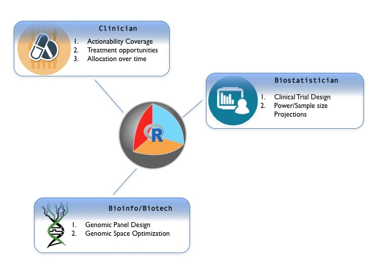
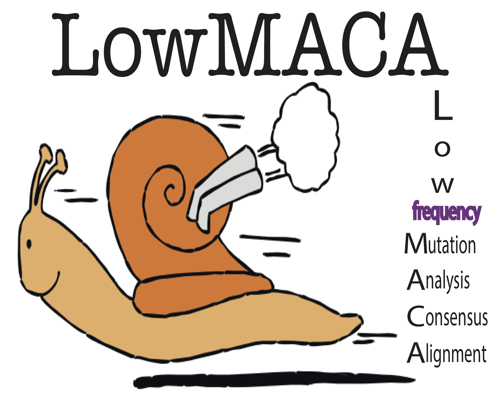

# Welcome

My name is Giorgio, currently postdoc and data scientist in [Park's Lab](https://compbio.hms.harvard.edu/) 
at the [Department of Biomedical Informatics](https://dbmi.hms.harvard.edu/careers/postdoctoral-fellows/park-lab) at Harvard Medical School.

I won't write that much here. Just posting my projects on github, gitlab or elsewhere!


### [Precision Trial Designer](https://gmelloni.github.io/ptd)

<a href="https://gmelloni.github.io/ptd">

</a>

```
In recent years, two new forms of clinical trial designs emerged 
in clinical cancer genomics: umbrella and basket trials.
Designs of such trials can be extremely difficult, 
starting from the creation of a valid screening panel, 
to the optimization of sequencing space and to the calculation 
of a correct sample size for the trial.
PTD provides a series of tools that can help bioinformaticians, 
clinicians and biostatisticians to design, 
analyze and finalize a custom gene panel for cancer genomics.
```

<!-- 
<div class="boxed">
In recent years, two new forms of clinical trial designs emerged 
in clinical cancer genomics: umbrella and basket trials.
Designs of such trials can be extremely difficult, 
starting from the creation of a valid screening panel, 
to the optimization of sequencing space and to the calculation 
of a correct sample size for the trial.
PTD provides a series of tools that can help bioinformaticians, 
clinicians and biostatisticians to design, 
analyze and finalize a custom gene panel for cancer genomics.
</div>

 -->
<!-- [](https://gmelloni.github.io/ptd) -->


----------------------

### [LowMACA](https://bmcbioinformatics.biomedcentral.com/articles/10.1186/s12859-016-0935-7)

```
LowMACA (Low frequency Mutation Analysis via Consensus Alignment) 
is a new method able to assess specific characteristics of rarely 
mutated genes that show patterns of positive selection.

LowMACA aggregates and analyzes the mutational patterns of several genes 
whose encoded proteins have a high level of sequence similarity 
or share specific protein domains.

By aligning the protein sequences of selected genes targeted 
by mutations and piling up these mutations according to the 
relative position derived from the alignment, LowMACA can 
dissect the whole protein family and assess the statistical 
significance of specific clusters of mutations.
```

[](http://cgsb.genomics.iit.it/wiki/projects/LowMACA)

Available on [Bioconductor](http://www.bioconductor.org/packages/release/bioc/html/LowMACA.html)! 

----------------------

### [TransformPhenotype](https://github.com/gmelloni/transformPhenotype)


```
A shiny app to normalize continuous traits in Genome-wide 
association studies
```

[](https://github.com/gmelloni/transformPhenotype)


----------------------

### [DOTS-Finder]((https://genomemedicine.biomedcentral.com/articles/10.1186/gm563))

```
Driver Oncogenes and Tumor Suppressors finder is a tool 
to identify driver genes from exome-sequencing data 
of a cohort of cancer samples
```

[](http://cgsb.genomics.iit.it/wiki/projects/DOTS-Finder)

<!-- 

## Welcome to GitHub Pages

You can use the [editor on GitHub](https://github.com/gmelloni/gmelloni.github.io/edit/master/README.md) to maintain and preview the content for your website in Markdown files.

Whenever you commit to this repository, GitHub Pages will run [Jekyll](https://jekyllrb.com/) to rebuild the pages in your site, from the content in your Markdown files.

### Markdown

Markdown is a lightweight and easy-to-use syntax for styling your writing. It includes conventions for

```markdown
Syntax highlighted code block

# Header 1
## Header 2
### Header 3

- Bulleted
- List

1. Numbered
2. List

**Bold** and _Italic_ and `Code` text

[Link](url) and 
```

For more details see [GitHub Flavored Markdown](https://guides.github.com/features/mastering-markdown/).

### Jekyll Themes

Your Pages site will use the layout and styles from the Jekyll theme you have selected in your [repository settings](https://github.com/gmelloni/gmelloni.github.io/settings). The name of this theme is saved in the Jekyll `_config.yml` configuration file.

### Support or Contact

Having trouble with Pages? Check out our [documentation](https://help.github.com/categories/github-pages-basics/) or [contact support](https://github.com/contact) and we’ll help you sort it out.

-->